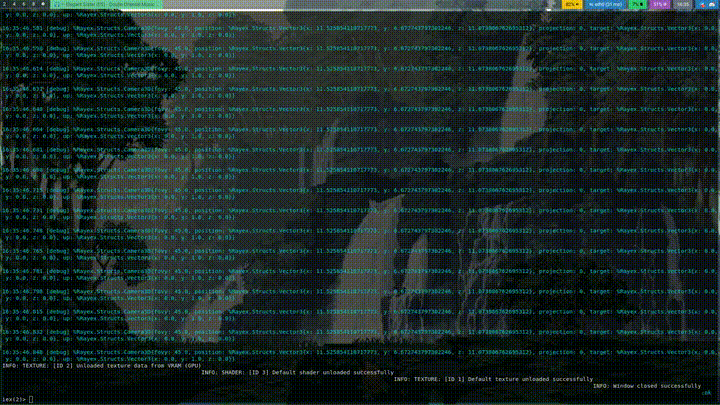

# Rayex

[](https://hex.pm/packages/rayex)
[](https://hexdocs.pm/rayex/)
[](https://github.com/shiryel/rayex/actions/workflows/test.yml)

[![BlueSky](https://img.shields.io/badge/bsky-follow-blue.svg?logo=data:image/svg%2bxml;base64,iVBORw0KGgoAAAANSUhEUgAAABAAAAAQCAYAAAAf8/9hAAAAAXNSR0IArs4c6QAAAMZlWElmTU0AKgAAAAgABgESAAMAAAABAAEAAAEaAAUAAAABAAAAVgEbAAUAAAABAAAAXgEoAAMAAAABAAIAAAExAAIAAAAVAAAAZodpAAQAAAABAAAAfAAAAAAAAABIAAAAAQAAAEgAAAABUGl4ZWxtYXRvciBQcm8gMy41LjEAAAAEkAQAAgAAABQAAACyoAEAAwAAAAEAAQAAoAIABAAAAAEAAAAQoAMABAAAAAEAAAAQAAAAADIwMjM6MTI6MjEgMTg6NDc6NTUAs+CevwAAAAlwSFlzAAALEwAACxMBAJqcGAAAA7BpVFh0WE1MOmNvbS5hZG9iZS54bXAAAAAAADx4OnhtcG1ldGEgeG1sbnM6eD0iYWRvYmU6bnM6bWV0YS8iIHg6eG1wdGs9IlhNUCBDb3JlIDYuMC4wIj4KICAgPHJkZjpSREYgeG1sbnM6cmRmPSJodHRwOi8vd3d3LnczLm9yZy8xOTk5LzAyLzIyLXJkZi1zeW50YXgtbnMjIj4KICAgICAgPHJkZjpEZXNjcmlwdGlvbiByZGY6YWJvdXQ9IiIKICAgICAgICAgICAgeG1sbnM6dGlmZj0iaHR0cDovL25zLmFkb2JlLmNvbS90aWZmLzEuMC8iCiAgICAgICAgICAgIHhtbG5zOmV4aWY9Imh0dHA6Ly9ucy5hZG9iZS5jb20vZXhpZi8xLjAvIgogICAgICAgICAgICB4bWxuczp4bXA9Imh0dHA6Ly9ucy5hZG9iZS5jb20veGFwLzEuMC8iPgogICAgICAgICA8dGlmZjpZUmVzb2x1dGlvbj43MjAwMDAvMTAwMDA8L3RpZmY6WVJlc29sdXRpb24+CiAgICAgICAgIDx0aWZmOlhSZXNvbHV0aW9uPjcyMDAwMC8xMDAwMDwvdGlmZjpYUmVzb2x1dGlvbj4KICAgICAgICAgPHRpZmY6UmVzb2x1dGlvblVuaXQ+MjwvdGlmZjpSZXNvbHV0aW9uVW5pdD4KICAgICAgICAgPHRpZmY6T3JpZW50YXRpb24+MTwvdGlmZjpPcmllbnRhdGlvbj4KICAgICAgICAgPGV4aWY6UGl4ZWxZRGltZW5zaW9uPjE2PC9leGlmOlBpeGVsWURpbWVuc2lvbj4KICAgICAgICAgPGV4aWY6UGl4ZWxYRGltZW5zaW9uPjE2PC9leGlmOlBpeGVsWERpbWVuc2lvbj4KICAgICAgICAgPHhtcDpNZXRhZGF0YURhdGU+MjAyMy0xMi0yMVQxOTowMDo1Ni0wODowMDwveG1wOk1ldGFkYXRhRGF0ZT4KICAgICAgICAgPHhtcDpDcmVhdGVEYXRlPjIwMjMtMTItMjFUMTg6NDc6NTUtMDg6MDA8L3htcDpDcmVhdGVEYXRlPgogICAgICAgICA8eG1wOkNyZWF0b3JUb29sPlBpeGVsbWF0b3IgUHJvIDMuNS4xPC94bXA6Q3JlYXRvclRvb2w+CiAgICAgIDwvcmRmOkRlc2NyaXB0aW9uPgogICA8L3JkZjpSREY+CjwveDp4bXBtZXRhPgojNmzBAAAB2klEQVQ4EaVTPWsUURS95824grqJMRuSSlMkdUQ0pNHOP2Al+AMklSKIBhEXkmFRsbFKE2zERtFKIY0khR+IYCystDAiajDGzfoBupl3vPe5s/tc1CZ3Pu45995z5857MyKbNPTOcL8DqyJ4lKRydfUMvvyvZ+Uiyxu5nAA54R0uoC/LZ1V8vCV6TYcj9Sk8+1uT3oz7nPC25vb8znPWKWBUPAzPxf4aD0SxAPtnOK7iBSUtcQjTGnwKsHMre897PTWOFKGeaY568K7ychEzD5HVVOg+COIhQkklyXlruMoJY+vgTXWVkIluFLeSKl+OYh0IGVtP/TQh0HOsk4gQZBmDl7n95w++0nmGolQBmwp0UrEHddv7UgmjbuU0vuUJDmp2Xi8TxLZFSbfYauZzh0OmtUWUxhR0AmQKbaHqFvuHren+3/Aek0GjRTae7My4F8KnChPjkRWrG+qi+Ec0MbJWRSNMoJuwQ5PdYqt/ol/JUiQs4MBGIoNGQoPP5+SB4odFtu2J6wTutHkL6Lbcb5zHS6Ohgb4/9Tiq/E2rxtzb0la5lqYyp/hrOw55kaQ4VvA/3m3gEofypq9pw936o5yqn8VzK9yV8TDJkzrN421NufKuiu9Fg037X+nGlJl3fvK1AAAAAElFTkSuQmCC)](shiryel.bsky.social)

Rayex provides Elixir NIF bindings to [Raylib](https://www.raylib.com/)

> NOTE: some of the functions on raylib are not implemented yet, check the [contributing section](#contributing) to help



## Installation

The package can be installed by adding `rayex` to your list of dependencies in `mix.exs`:

```elixir
def deps do
  [
    {:rayex, "~> 0.0.3"}
  ]
end
```

The docs can be found at [https://hexdocs.pm/rayex](https://hexdocs.pm/rayex).

## Running from source

You need the following packages installed on your system:
* elixir
* erlang (headers)
* pkg-config
* raylib v5
* glibc
* clang-tools (formatter)

> If you are using Nix or NixOS you can run __nix develop__ to get an ready to go env to work with!

Now you can run:
```bash
mix deps.get
iex -S mix
```

And test with:
```exs
# Import all modules
iex> use Rayex

# open new window
iex> init_window(200, 200, "window name")

# draw a line
iex> begin_drawing()
iex> draw_line(10, 10, 50, 51, %{r: 255, g: 161, b: 0, a: 255})
iex> end_drawing()
```

You can also run our examples!!

```bash
cd examples/3d_picking/
mix deps.get
iex -S mix
```
```exs
iex> The3dPicking.run()
```

## Contributing

There are a few things that you need to know about the code:
* This project aims to run each one of [those functions](https://www.raylib.com/cheatsheet/cheatsheet.html) with elixir
* To do so, we are using [Unifex](https://hexdocs.pm/unifex/readme.html) to create NIFs
* On `c_src/rayex/rayex.spec.exs` you can find the definitions that will be generated by Unifex
* On `c_src/rayex/rayex.c` you can find how they are implemented
* On `c_src/rayex/rayex.h` and `lib/unifex/code_generator/base_types/...` you can find custom types
* On `lib/rayex/unifex/raylib.ex` is where the generated functions will be stored and used for each module under `lib/rayex`, the public API

Any contributions are appreciated

## License

   Copyright 2021 Shiryel

   Licensed under the Apache License, Version 2.0 (the "License");
   you may not use this file except in compliance with the License.
   You may obtain a copy of the License at

       http://www.apache.org/licenses/LICENSE-2.0

   Unless required by applicable law or agreed to in writing, software
   distributed under the License is distributed on an "AS IS" BASIS,
   WITHOUT WARRANTIES OR CONDITIONS OF ANY KIND, either express or implied.
   See the License for the specific language governing permissions and
   limitations under the License.
